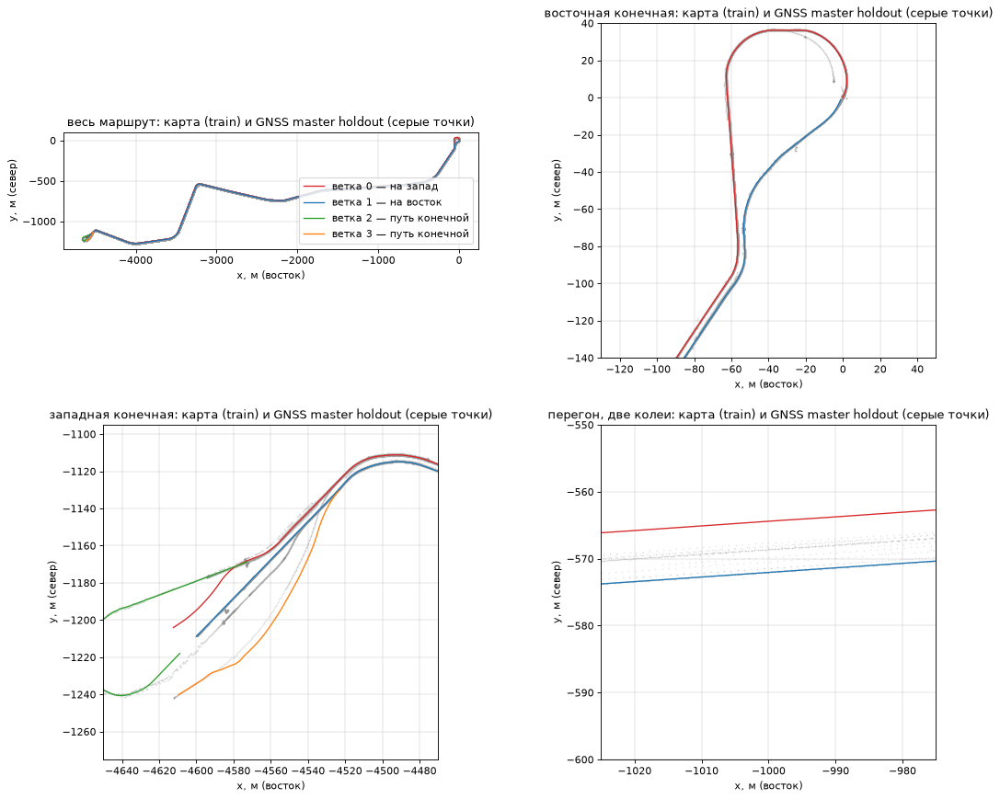

# Карта маршрута: поперечное расстояние GNSS holdout до карты (issue #8, M1)

Карта `src/tram_odometry/maps/route.csv` построена только по train (GNSS master, статус 2),
holdout в построении не участвует. Код построения — `tools/pathgraph/build_route.py` на
commit `e62fdfc` плюс незакоммиченные файлы ветки `worktree-8-route-map` (сама карта и
инструменты этого PR).

Машина: `Linux 7.2.6-arch2-1 x86_64`, `nproc` = 16; Python 3.14.7, numpy 2.5.3, scipy 1.18.1, rosbags 0.11.5. Построение и проверка — около 4 с каждая.

```bash
.venv/bin/python tools/pathgraph/build_route.py
.venv/bin/python tools/pathgraph/check_route.py --plot docs/verification/2026-09-25-route-map.png
```

Построение:

```
branch 0: 5509 m, 18 passes, reference 30618_8158f0b0
branch 1: 5407 m, 19 passes, reference 30618_2f104a1d
branch 2: 179 m, extra, from (-4573, -1169) to (-4609, -1218)
branch 3: 145 m, extra, from (-4610, -1240) to (-4523, -1131)
```

## Критерий приёмки: mean ≤ 1,5 м, p99 ≤ 5 м — выполнен

Holdout: 26 bag, 288 137 фиксов master со статусом ≥ 0, выбросы отфильтрованы тем же
фильтром, что и при построении (медиана по окну 11 фиксов, порог 3 м).

| выборка | mean, м | median, м | p95, м | p99, м | max, м |
|---|---|---|---|---|---|
| **own, все статусы** | **0.41** | 0.02 | 3.32 | **4.95** | 25.1 |
| nearest, все статусы | 0.35 | 0.02 | 2.48 | 4.93 | 20.7 |
| own, status 0 (20 %) | 0.68 | 0.40 | 2.83 | 4.23 | 25.1 |
| own, status 1 (0 %) | 0.41 | 0.34 | 0.40 | 1.06 | 9.1 |
| own, status 2 (80 %) | 0.35 | 0.01 | 3.88 | 4.96 | 15.6 |

- **own** — до ветки своего направления (0 — на запад, 1 — на восток) или до пути конечной
  (ветки ≥ 2). Это строгая цифра: колеи двух направлений разнесены примерно на 8 м, и
  расстояние до ближайшей ветки спрятало бы попадание на чужую колею.
- **nearest** — до ближайшей ветки.

По bag (own):

| bag | фиксов | own mean, м | own p99, м | nearest mean, м |
|---|---|---|---|---|
| 30618_01f73500 | 11952 | 0.37 | 4.24 | 0.27 |
| 30618_0686195f | 11363 | 0.85 | 7.21 | 0.81 |
| 30618_082f1d65 | 230 | 3.21 | 3.22 | 3.21 |
| 30618_2050d396 | 13432 | 0.47 | 4.96 | 0.47 |
| 30618_27e994fc | 18454 | 1.18 | 15.02 | 0.81 |
| 30618_33bec73f | 11800 | 0.35 | 4.85 | 0.35 |
| 30618_3e9f4952 | 13211 | 0.44 | 4.27 | 0.24 |
| 30618_437e855c | 11467 | 0.37 | 4.22 | 0.32 |
| 30618_67b89902 | 9859 | 0.02 | 0.21 | 0.02 |
| 30618_88548b02 | 12442 | 0.51 | 1.46 | 0.51 |
| 30618_a53d5f6f | 11922 | 0.44 | 5.05 | 0.27 |
| 30618_a869780d | 10833 | 0.39 | 4.28 | 0.33 |
| 30618_d4ba7005 | 11609 | 0.01 | 0.05 | 0.01 |
| 30618_dd8d0741 | 12556 | 0.30 | 4.22 | 0.26 |
| 30618_dd8e6395 | 12287 | 0.49 | 8.00 | 0.26 |
| 30618_defd0170 | 9810 | 0.60 | 2.40 | 0.59 |
| 30618_e9a34502 | 12040 | 0.01 | 0.05 | 0.01 |
| 30639_0ab96c59 | 821 | 4.94 | 4.94 | 4.94 |
| 30639_0be558e2 | 12820 | 0.34 | 4.21 | 0.29 |
| 30639_2b4a6347 | 11114 | 0.52 | 1.12 | 0.52 |
| 30639_4285f2bc | 12988 | 0.37 | 3.95 | 0.36 |
| 30639_50956d6e | 11008 | 0.34 | 4.24 | 0.27 |
| 30639_584b6e32 | 11401 | 0.47 | 4.91 | 0.41 |
| 30639_927002c2 | 11446 | 0.01 | 0.05 | 0.01 |
| 30639_9f0b519f | 10309 | 0.22 | 4.93 | 0.21 |
| 30639_d927f360 | 10963 | 0.02 | 0.09 | 0.02 |



## Что видно в данных

- **Поездки на восток с RTK ложатся на карту с точностью 1–2 см** за весь прогон
  (`e9a34502`, `d4ba7005`, `927002c2`, `67b89902`, `d927f360`: статус 2 почти везде).
  Трамвай на рельсах вбок не гуляет, поэтому GNSS со статусом 2 повторяется от прогона к
  прогону. Утечки из train нет: точных совпадений lat/lon с любым train bag не больше 28
  на ~10 тыс. фиксов (совпадения на стоянках).
- **В поездках на запад GNSS шумнее**: в каждом проходе train есть ступеньки 3–20 м за
  0,1 с (плавающее решение), отсюда p99 ≈ 4 м у `01f73500`, `3e9f4952` и других. Это шум
  самого эталона: эталон жюри на этом направлении тоже будет прыгать на метры.
- **Хвост p99 дают стоянки на конечных и статус 0**: `27e994fc` (p99 15 м, в середине
  прогона 617 скачков GNSS), `0ab96c59` и `082f1d65` (короткие прогоны на стоянке с
  постоянным смещением 3–5 м).
- **Западная конечная — петля и 2–3 параллельных пути отстоя** на расстоянии 8–10 м.
  Одна полилиния на направление давала там 4 % фиксов дальше 5 м. Решение — ветки
  конечной (≥ 2), см. `tools/pathgraph/README.md`.
